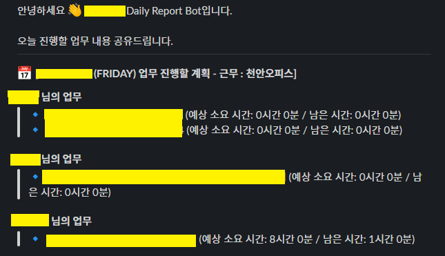

회사에서 매일 업무 시작과 종료 시에 데일리 리포트를 작성한다.

예를 들어 이렇게 작성 한다.

업무 시작

<aside>
💡 0000.00.00 (월) 금일 업무 수행할 계획 [근무지: xxx오피스]

[Jira 티켓] [BE] 테스트 코드 작성 estimated 1h / left 1h

</aside>

업무 종료 

<aside>
💡 0000.00.00 (월) 금일 업무 수행한 내용 [근무지: xxx오피스]

[Jira 티켓] [BE] 테스트 코드 작성 estimated 1h / left 1h / progress 1h --> left 0h [done]

</aside>

업무의 시작과 종료에 어떤 업무를 해야 하고 얼마나 진행했는지 파악하기는 좋지만, 불편한 점이 몇 가지가 있었다.

1. 날짜, 요일, Jira 티켓 넘버 등 오타 발생
- 아무래도 수기로 작성하다 보니 잘못된 날짜나 요일로 작성하거나 Jira 티켓 넘버가 맞지 않는 오류가 있어서 나중에 발견하고 수정하는 경우가 종종 있었다.
1. 데일리 리포트 작성 자체를 잊어버리는 경우가 발생
- 보통의 경우라면 까먹지 않지만, 아침에 출근하자마자 이슈가 생겨서 회의를 하거나, 버그 발생으로 정신 없는 상태라면 잊어버리는 경우가 생겼다.
1. Jira에 있는 정보를 작성할 필요가 있을까?
- 데일리 리포트는 말하자만 직접 작성하는 Jira 티켓이다. Jira에 똑같은 내용을 확인할 수 있는데 굳이 Slack 채널에 메시지를 작성해야 하는지와 같은 필요성에 의문이 들었다.

이러한 문제점들이 있어서 데일리 리포트를 자동화해주는 서버를 만들어 효율을 높이려 시도했다. 

먼저 구현 흐름은 이렇게 잡았다.

1. Jira API를 이용해서 원하는 이슈 정보 불러온다.
    1. 데일리 리포트에 [진행 중]인 이슈와 오늘 완료한 [완료됨]의 이슈의 정보가 필요함
2. 불러온 이슈를 서버에서 가공
    1. 회사에서 사용하는 데일리 리포트 양식이 있었기 때문에 해당 양식으로 출력해야 하기 때문에 가공하는 작업이 필요하다.
    2. 이슈의 추정 시간, 소요 시간 등은 가져올 수 있지만 진행한 시간은 계산을 해야 했기 때문에 해당 로직도 필요하다.
3. 평일 (월 ~ 금) 업무 시작 시간인 오전 09시와 업무 종료 시간인 오후 06시에 @Scheduler를 사용하여 자동으로 Slack으로 메시지를 보낸다. 

### 1. 프로젝트 생성

```groovy
// build.gradle

```

dependencies {
	implementation 'org.springframework.boot:spring-boot-starter-batch'
	implementation 'org.springframework.boot:spring-boot-starter-web'
	implementation 'org.springframework.cloud:spring-cloud-starter-openfeign'
	testImplementation 'org.springframework.boot:spring-boot-starter-test'
	testImplementation 'org.springframework.batch:spring-batch-test'
	testRuntimeOnly 'org.junit.platform:junit-platform-launcher'
	implementation("com.slack.api:bolt:1.18.0")
	implementation("com.slack.api:bolt-servlet:1.18.0")
	implementation("com.slack.api:bolt-jetty:1.18.0")
	compileOnly 'org.projectlombok:lombok'
	annotationProcessor 'org.projectlombok:lombok'
}

```
```

- Jira API 연동을 위해 openfeign 의존성을 추가해주고 scheduler batch job을 위해 spring batch를 추가해준다.
- Slack Message를 이용하기 위해 Slack 의존성도 추가해준다.

### 2. Jira에서 이슈 정보를 가져오기

- 먼저 @EnableScheduling, @EnableFeignClients 를 추가해서 scheduler와 feign client를 활성화 해준다.
    
    ```java
    @SpringBootApplication
    @EnableScheduling // 추가 
    @EnableFeignClients // 추가 
    public class DailyreportApplication {
    
    	public static void main(String[] args) {
    		SpringApplication.run(DailyreportApplication.class, args);
    	}
    
    }
    ```
    
- Feign client를 이용하여 Jira api에 issue 정보를 요청한다.
    
    ```java
    @FeignClient(name = "jiraClient", url = JIRA_URL)
    public interface JiraClient {
        @GetMapping
        String loadJiraIssue(@RequestParam String jql,
    											   @RequestHeader("Authorization") String token);
    }
    ```
    
    - 여기서 jql은 Jira Query Language이다.  Jira Issue 를 검색하기 위한 구조적인 언어이다.
- Jira API에서 받아온 정보를 가공하여 Slack으로 전송한다.
    - Slack에서는 메시지를 Block Template를 이용하여 작성할 수 있다.
        
        [](https://app.slack.com/block-kit-builder)
        
    - Slack API를 이용하여 Blocks를 이용하여 원하는 템플릿을 만들고 chatPostMessage를 이용하여 메시지를 보낸다.
    
    ```java
    public void generateBlocks() {
        List<LayoutBlock> blocks = new ArrayList<>();
        blocks.add(section(section -> section.text(markdownText(helloChat()))));
        blocks.add(divider());
        blocks.add(section(section -> section.text(markdownText(title()))));
        blocks.add(section(section -> section.text(markdownText(makeEndMessage(issueDto)))));
        blocks.add(divider());
        blocks.add(section(section -> section.text(markdownText(endChat()))));
    }
    
    ```
    
    public void sendMessage(List<LayoutBlock> blocks) {
        MethodsClient methods = Slack.getInstance().methods(SLACK_TOKEN);
        ChatPostMessageRequest request = ChatPostMessageRequest.builder()
                .channel(SLACK_CHANNEL)
                .blocks(blocks)
                .build();
        methods.chatPostMessage(request);
    }
    
    ```
    
    private String helloChat(){
        StringBuilder sb = new StringBuilder();
        return sb.append("안녕하세요 :wave: Daily Report Bot입니다. \n \n 오늘 진행할 업무 내용 공유드립니다. \n").toString();
    }
    private String title(){
        DayOfWeek 요일 = LocalDateTime.now().getDayOfWeek();
        StringBuilder sb = new StringBuilder();
        String 날짜 = LocalDateTime.now().format(DateTimeFormatter.ofPattern("yyyy.MM.dd"));
        return sb.append(":date: *[").append(날짜).append(" (").append(요일).append(") 업무 진행할 계획 - 근무 : 00오피스]*")
                .append("\n").toString();
    }
    
    private String endChat(){
        StringBuilder sb = new StringBuilder();
        return sb.append("오늘도 좋은 하루 보내세요 :slightly_smiling_face:").toString();
    }
    ```
    

### 3. 스케줄러를 사용하여 일정한 시간에 Slack Message 전송

```java
@Scheduled(cron = "0 0 9 * * 1-5", zone = "Asia/Seoul") // 매일 오전 9시 실행
public void runDailyReport() {
		sendSlackMessage.sendMessage();	
}
```

### 결과

성공적으로 메시지가 나오는 모습을 보인다.

