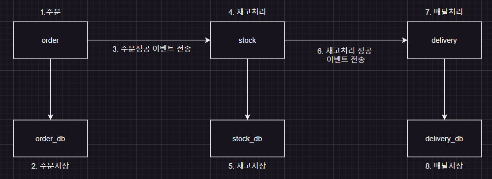
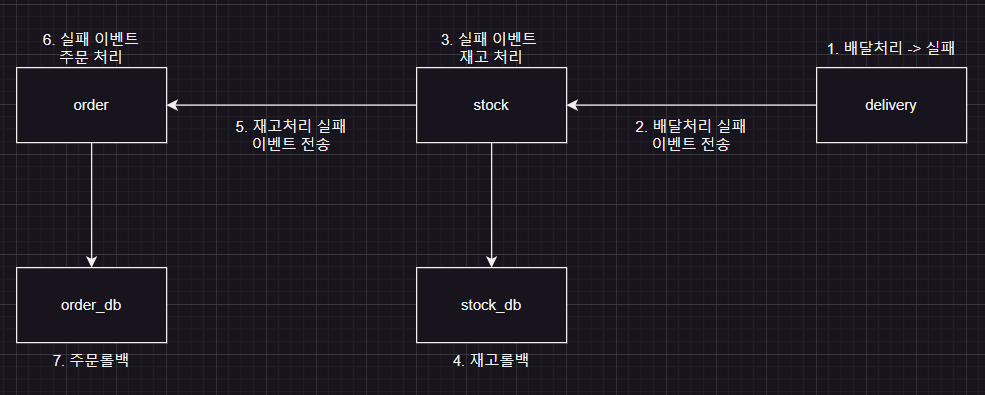

Saga 패턴에 대해서 알아보고 간단하게 구현해보자.

### Saga 패턴이란?

Saga 패턴은 분산 시스템에서 연속된 서비스 호출이 하나의 트랜잭션처럼 동작되도록 설계된 패턴이다. 

긴 트랜잭션을 여러 개의 작은 서비스로 나누어 처리하는 방식으로, 각각의 서비스가 독립적으로 트랜잭션을 수행하지만, 그 전체를 하나의 트랜잭션처럼 다루는 효과를 얻을 수 있다. 

### Saga 패턴의 특징
1. 트랜잭션 분할 : 대규모 분산 시스템에서는 하나의 트랜잭션을 여러 서비스에 분배하여 처리하므로, 긴 트랜잭션을 분할하여 리소스나 네트워크를 효율적으로 관리할 수 있다.
2. 각 서비스의 독립성 : 각 서비스가 개별적으로 관리되고, 하나의 서비스에서 실패가 발생하면 이를 보상하는 방식으로 처리된다.
3. 보상 처리 : 트랜잭션이 실패했을 겨우, 이미 완료된 트랜잭션을 취소하기 위한 보상 처리 방법을 정의한다.
4. 비동기 메시징 : 여러 서비스들이 비동기적으로 통신하며, 각 서비스 간의 의존성이나 트랜잭션을 유지하기 위해 메시징 시스템을 사용하는 경우가 많다. 

### Saga 패턴의 구현 방식
- Choreography: 각 서비스가 자신이 해야 할 일을 처리하고, 다음 서비스로 메시지를 보내는 방식
- Orchestration : 중앙 제어자가 각 서비스의 흐름을 관리한다. 


이번 포스팅에선 Java, SpringBoot, Kafka를 이용하여 Choreography 방식 예시를 알아보자.

먼저 구현할 도메인은 order, stock, delivery 세 가지 도메인이다.

order 도메인에서 주문을 처리하면 stock 도메인에서 재고 처리가 되고, delivery 도메인에서 배달 처리가 된다.

다이어그램으로 살펴보면 다음과 같다.



실패할 경우는, delivery에서 실패가 일어났다고 가정한다.

delivery에서 실패하면 stock 도메인으로 실패 이벤트(rollback)를 전송하고 stock 도메인에서 실패 이벤트에 따른 DB 정보를 rollback 한다.

그리고 order 도메인으로 stock rollback 이벤트를 보내고 order 도메인에서도 실패 이벤트에 따른DB 정보를 rollback 한다.

다이어그램으로 살펴보면 다음과 같다.



직접 구현해보자. [예제코드주소](https://github.com/Ghosttrio/saga-pattern)


먼저 이벤트 처리에 필요한 Kafka와 Zookeeper를 Docker 컨테이너 형태로 띄워보자.

각 이벤트에 맞는 토픽을 1:1로 만들어준다.

```yaml
version: "3"
services:
  zookeeper:
    image: wurstmeister/zookeeper
    ports:
      - "2181:2181"
  kafka:
    image: wurstmeister/kafka
    ports:
      - "9092:9092"
    environment:
      KAFKA_ADVERTISED_HOST_NAME: 127.0.0.1
      KAFKA_CREATE_TOPICS: "order-commit:1:1, stock-commit:1:1, delivery-commit:1:1, order-rollback:1:1, stock-rollback:1:1, delivery-rollback:1:1"
      KAFKA_ZOOKEEPER_CONNECT: zookeeper:2181
    volumes:
      - /var/run/docker.sock:/var/run/docker.sock
```

```bash

docker compose up -d

```

다음으로 각 도메인을 구현해보자.


```java

// order

@Entity
@Getter
@AllArgsConstructor
@NoArgsConstructor
public class OrderEntity {

    @Id @GeneratedValue(strategy = GenerationType.IDENTITY)
    private Long id;
    private Long productId;
    private String productName;
    private Long quantity;

    public static OrderEntity create(Long productId, String productName, Long quantity) {
        return new OrderEntity(null, productId, productName, quantity);
    }
}

// stock

@Entity
@Getter
@AllArgsConstructor
@NoArgsConstructor
public class StockEntity {

    @Id @GeneratedValue(strategy = GenerationType.IDENTITY)
    private Long id;
    private Long productId;
    private Long stock;
}

// delivery

@Entity
@Getter
@AllArgsConstructor
@NoArgsConstructor
public class DeliveryEntity {

    @Id @GeneratedValue(strategy = GenerationType.IDENTITY)
    private Long id;
    private Long productId;
}


```

카프카의 Producer Consumer 구조는 이렇다.

```java

// 성공
OrderController -> OrderService -> StockConsumer -> StockService -> DeliveryConsumer

// 롤백
DeliveryService -> StockConsumer -> StockService -> OrderConsumer -> OrderService

```

성공 시 코드

```java

// order

@Slf4j
@RestController
@RequiredArgsConstructor
public class OrderController {

    private final OrderService orderService;

    @PostMapping("/order")
    public void createOrder(@RequestBody CreateOrderRequest request) {
        log.info("=====> 주문 시작 (1)");
        orderService.order(request.getProductId(), request.getProductName(), request.getQuantity());
    }

}

@Service
@RequiredArgsConstructor
@Slf4j
public class OrderService {

    private final OrderRepository orderRepository;
    private final KafkaTemplate<String, SagaEvent> kafkaTemplate;

    @Transactional
    public void order(Long productId, String productName, Long quantity) {
        log.info("=====> 주문 저장 실행 (2)");
        OrderEntity orderEntity = OrderEntity.create(productId, productName, quantity);
        OrderEntity result = orderRepository.save(orderEntity);
        log.info("=====> 주문 저장 성공 (3)");
        createOrderProducer(result.getId());
    }

    public void createOrderProducer(Long orderId) {
        log.info("=====> 주문 저장 이벤트 전송 실행 (4)");
        SagaEvent sagaEvent = new SagaEvent();
        sagaEvent.setOrderId(orderId);
        sagaEvent.setStatus("ORDER_CREATED");
        kafkaTemplate.send("order-commit", sagaEvent);
    }
...


// stock

@Slf4j
@Component
@RequiredArgsConstructor
public class StockConsumer {

    private final StockService stockService;

    @KafkaListener(topics = "order-commit" , groupId = "group-ghosttrio")
    public void orderCommitConsumer(SagaEvent sagaEvent) {
        log.info("=====> order commit 컨슈머 실행 (5)");
        stockService.decreaseStock(sagaEvent);
    }
...

@Service
@RequiredArgsConstructor
@Slf4j
public class StockService {

    private final KafkaTemplate<String, SagaEvent> kafkaTemplate;

    @Transactional
    public void decreaseStock(SagaEvent sagaEvent) {
        log.info("=====> 재고 작업 실행 (6)");
        // 재고 작업 코드
        log.info("=====> 재고 작업 종료 (7)");
        createStockProducer(sagaEvent);
    }

    public void createStockProducer(SagaEvent sagaEvent) {
        log.info("=====> 재고 저장 이벤트 전송 실행 (8)");
        sagaEvent.setStatus("STOCK_CREATED");
        kafkaTemplate.send("stock-commit", sagaEvent);
    }
...


// delivery
@Slf4j
@Component
@RequiredArgsConstructor
public class DeliveryConsumer {

    private final DeliveryService deliveryService;

    @KafkaListener(topics = "stock-commit" , groupId = "group-ghosttrio")
    public void stockCommitConsumer(SagaEvent sagaEvent) {
        log.info("=====> stock commit 컨슈머 실행 (9)");
        deliveryService.delivery(sagaEvent);
    }

}

@Service
@RequiredArgsConstructor
@Slf4j
public class DeliveryService {

    private final KafkaTemplate<String, SagaEvent> kafkaTemplate;

    @Transactional
    public void delivery(SagaEvent sagaEvent) {
        try {
            log.info("=====> 배달 작업 시작 (10)");
            error(); // 에러를 일으킬만한 코드
            // 배달 작업 코드
            log.info("=====> 배달 작업 종료 (11)");
        } catch (RuntimeException e) {
            log.info("xxxxx> 배달 작업에서 롤백 실행 (1)");
            sagaEvent.setStatus("DELIVERY_ROLLBACK");
            kafkaTemplate.send("delivery-rollback", sagaEvent);
        }
    }

    private void error() {
        int zeroOrOne = new Random().nextInt(2);
        if (zeroOrOne == 0) {
            throw new RuntimeException();
        }
    }

}


```

delivery에서 확률적으로 에러가 나게 만들었다.

실패 시 코드

```java

// stock

...

@KafkaListener(topics = "delivery-rollback" , groupId = "group-ghosttrio")
public void deliveryRollbackConsumer(SagaEvent sagaEvent) {
    log.info("xxxxx> delivery rollback 컨슈머 실행 (2)");
    stockService.rollbackStock(sagaEvent);
}

...

...

@Transactional
public void rollbackStock(SagaEvent sagaEvent) {
    log.info("xxxxx> stock 롤백 실행 (3)");
    // 롤백하는 코드
    log.info("xxxxx> stock 롤백 종료 (4)");

    rollbackStockProducer(sagaEvent);
}

public void rollbackStockProducer(SagaEvent sagaEvent) {
    sagaEvent.setStatus("STOCK_ROLLBACK");
    log.info("xxxxx> stock rollback 이벤트 실행 (5)");
    kafkaTemplate.send("stock-rollback", sagaEvent);
}

...

// order

@Slf4j
@Component
@RequiredArgsConstructor
public class OrderConsumer {

    private final OrderService orderService;

    @KafkaListener(topics = "stock-rollback" , groupId = "group-ghosttrio")
    public void stockRollbackConsumer(SagaEvent sagaEvent) {
        log.info("xxxxx> stock rollback 컨슈머 실행 (6)");
        orderService.orderRollback(sagaEvent);
    }
}


@Transactional
public void orderRollback(SagaEvent sagaEvent) {
    log.info("xxxxx> order rollback 작업 실행 (7)");
    orderRepository.deleteById(sagaEvent.getOrderId());
    log.info("xxxxx> order rollback 작업 종료 (8)");
}


```