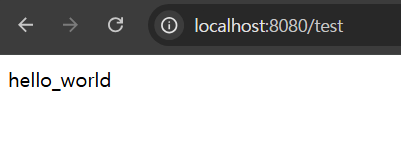

Spring Cloud Config와 Git을 사용해서 설정 정보 파일을 관리해보자.

### Spring Cloud Config란?

Spring Cloud Config는 분산 시스템 환경에서 애플리케이션의 설정을 중앙 집중식으로 관리하고 제공하는 데 사용되는 도구다.

예를 들어, Spring Boot에서 자주 사용하는 application.properties나 application.yml 파일을 외부에서 관리할 수 있게 해주며, 애플리케이션의 설정을 한 곳에서 쉽게 수정하고 공유할 수 있게 해준다.

그리고 각 서비스를 다시 빌드하지 않고, 바로 적용할 수 있는 기능을 지원한다.

또한 각 환경(개발, 테스트, 운영 등) 별로 다른 설정을 관리할 수 있다.

Spring Cloud Config를 다양한 방법으로 사용하는 것을 알아보자.


### 구현

Spring Cloud Config를 Git을 통해 설정 파일을 관리할 수 있다. 

Git에 설정 정보 파일을 올려두고 이 정보를 가져오는 방식으로 사용한다.

Git을 사용해 진행하기 위해 먼저 Local에 Git Repository를 생성하도록 하자.

```bash

mkdir spring-config-git && cd spring-config-git

git init

cat > application.yml
hello:
  world: hello_world

git add .

git commit -m "test yml upload"

```

Git 설정은 끝났고, Spring Cloud Config 서버를 만들어보자.

Spring Boot 프로젝트에서 Config Server 의존성을 추가해준다.

```gradle

implementation 'org.springframework.cloud:spring-cloud-config-server'

```

그리고 애플리케이션 파일에서 @EnableConfigServer 어노테이션을 추가해주자.

```java

@EnableConfigServer
@SpringBootApplication
public class TestConfigurationApplication {

    public static void main(String[] args) {
        SpringApplication.run(TestConfigurationApplication.class, args);
    }

}


```

해당 프로젝트에서 application.yml 파일도 수정해주자.

```yaml

server:
  port: 8888
spring:
  application:
    name: config-server
  cloud:
    config:
      server:
        git:
          uri: file:///깃로컬주소

```

작성을 완료했다면 서버를 띄우고 http://localhost:8888/application/default 주소로 접속해보자.

아래와 같이 나왔다면 성공이다.

```json

{
  "name": "application",
  "profiles": [
    "default"
  ],
  "label": null,
  "version": "23e0135b1e44514f5f36290ba683586b80fbeae9",
  "state": null,
  "propertySources": [
    {
      "name": "file:///C:\\spring-config-git/application.yml",
      "source": {
        "hello.world": "hello_world"
      }
    }
  ]
}

```

이렇게 띄운 설정 정보를 다른 서버에서 사용해보자.

새로운 프로젝트를 하나 생성하고 의존성을 추가하자.


```gradle

implementation 'org.springframework.cloud:spring-cloud-starter'
implementation 'org.springframework.cloud:spring-cloud-starter-config'

```

그리고 yml에서 설정 정보를 가져올 Spring Cloud Config의 주소를 입력해주자.

```yaml

spring:
  application:
    name: config-client
  config:
    import: optional:configserver:http://localhost:8888

```

이제 테스트를 위해 간단한 컨트롤러를 만들어주자.

```java

@RestController
@RequiredArgsConstructor
public class TestController {

    private final Environment environment;

    @GetMapping("/test")
    public String test() {
        return environment.getProperty("hello.world");
    }
}

```

그리고 이 서버의 주소(http://localhost:8080/test)로 요청을 보내보자.

아래와 같이 나온다면 성공이다!




이렇게 Git을 이용한 방법을 로컬에서뿐만 아니라 원격 저장소(Github)와 같은 곳에서도 가져올 수 있다.

config server의 yml을 아래와 같이 바꿔주고 해당 파일을 Github Repository에 업로드 하자.

```yaml
server:
  port: 8888
spring:
  application:
    name: config-server
  cloud:
    config:
      server:
        git:
          uri: 깃허브 레포지토리 주소
          default-label: master

```

이 또한 config server를 재구동하고 http://localhost:8080/test로 접속하면 hello_world 라는 문구가 나온다.