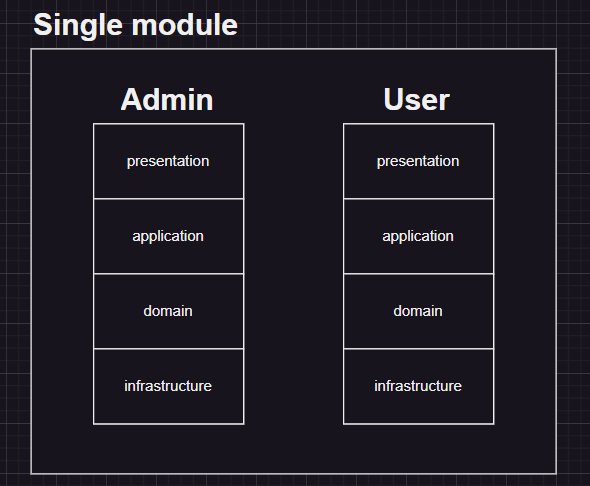
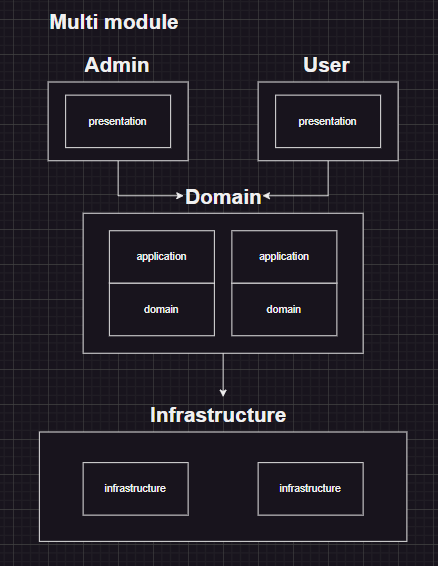

이전에 회사 프로젝트에 멀티 모듈을 적용하면서 알아봤던 내용과 왜 적용했는지를 정리해보자.

### 멀티모듈과 첫 만남

처음 멀티모듈이라는 것을 알게된 것은 공부 차 오픈소스를 둘러보던 중이었다.

당시에는 단일 모듈 프로젝트 이외엔 경험해보지 못했기 때문에, 조금 복잡한 구조네.. 싶었던 기억이 있다.

조금 더 코드를 둘러보고 Maven이나 Gradle과 같은 빌드 툴을 이용해 하나의 프로젝트에 여러 모듈을 적용한거구나! 라고 단순하게 생각했었다.

하지만 단순히 여러 프로젝트를 하나의 프로젝트로 모아 놓은 구조만은 아닌 것이라는 것을 시간이 좀 지나고 알게 되었다.

### 멀티모듈이란?

그렇다면 단순히 모듈을 모아놓은 구조만이 아니라면 멀티모듈은 무엇일까? 

멀티 모듈은 주로 소프트웨어 개발에서 하나의 프로젝트를 여러 개의 독립적인 모듈로 나누어 관리하는 방법을 말한다.

GPT에게 정의를 물어보니 이렇게 답한다.

GPT의 정의에서 "독립적인 모듈을 나누어"라는 문구에서 알 수 있는 단순히 **분리**한다는 개념뿐만 아니라, 모듈을 한 번에 **관리**하는 것에 좀 더 비중이 있다고 생각한다.

### 단일 모듈의 문제점

멀티 모듈이 아닌 단일 모듈의 문제점을 알아보자.

서비스가 커지면서 관리자페이지에 서비스의 상태를 모니터링하는 기능이나, 애플리케이션을 관리하는 기능의 추가가 필요해지는 경우가 생겼다.

문제는 단일 모듈 프로젝트에서, 관리자페이지에 기능을 추가해서 배포하려면 애플리케이션에 작동하는 코드까지 함께 배포가 되고 그에 따라 크고 작은 영향을 주게 된다는 것이다.

예를 들어, 관리자페이지에 사용자의 컨텐츠를 조회하는 기능에 다른 정보를 추가해서 가져오게 되면 해당 코드를 직간접적으로 사용하고 있던 애플리케이션 API는 영향이 갈 수 있다.

이를 인지하고 수정하면 괜찮지만, 그렇지 않은 경우에 문제가 생긴다.

코드 뿐만이 아니라 배포시에도 문제가 발생한다.

예를 들어, 관리자페이지에서만 발생한 테스트 실패로 인한 빌드 실패가 테스트 코드가 모두 통과한 애플리케이션 코드까지 실패하게 된다.

이러한 문제를 해결하기 위해 관리자와 애플리케이션의 코드를 분리할 필요성을 운영진, 개발자가 모두 느끼고 있었다.

### 멀티모듈을 적용한 이유

먼저 해당 문제를 해결할 가장 잘 알려진 방법은 마이크로서비스 아키텍처(MSA)를 적용하는 것이다.

실제로 이 방법을 먼저 적용하려고 시도했었다.

하지만 현재 프로젝트에 MSA는 맞지 않다고 결론이 났는데, 이유는 다음과 같다.

1. 회사 프로젝트가 MSA를 적용할 정도로 규모가 크지 않다.

- 회사 프로젝트는 단일 모듈을 적용해도 큰 문제는 없고, 프로젝트 백엔드 개발도 혼자서 하기 때문에 MSA로 하게 될 때는 관리 포인트가 늘어나고, 오히려 이러한 구조가 개발 문제 발생을 초래할 것으로 예상되었다.

2. MSA에 대한 지식 부족

- 저 문제에 대해 고민하던 당시엔, Spring Cloud나 K8S와 같은 MSA를 쉽게 구축할 수 있는 기술에 대한 지식도 부족했고, MSA 자체에 대한 지식도 거의 없는 상태였다.
- 이러한 상태에서 무작정 MSA를 구현하게 되면 문제가 발생할 것이 분명했다.

3. 분리된 코드 관리

- 1번과 비슷한 문제인데, MSA를 적용하게 되었을 때 분리된 프로젝트 안에서 각 도메인 로직을 계속 같게 유지해줘야 하는데 해당 부분에 대한 관리를 혼자서 하기에는 문제가 발생할 것을 보였다.

4. 비용 문제

- 현재 단일 모듈 프로젝트는 AWS EC2에 dev 서버, prod 서버 두 개의 인스턴스에 각각 올라가 있는 상태였다.
- 이러한 상황에서 MSA로 인한 인스턴스 증가는 결국 비용이 추가로 발생하는 것을 의미했고, 작은 규모의 스타트업에선 이것은 큰 부담이 되었다.

결국 리소스도 많이 필요하지 않고, 공통 코드는 잘 관리되며, 코드가 분리되어 확장성과 유지보수성을 가진 쉬운 구조가 필요했다.

이러한 문제들을 멀티 모듈 구조는 해결해준다.

- 멀티 모듈 구조에서는 프로젝트를 크게 바꾸지 않고 어렵지 않게 전환이 가능하며, 관리하기 편하게 만들어준다.
- 완벽히 분리된 구조를 만드려면, 인스턴스가 늘어나긴하지만 MSA로 전환했을 때의 리소스보단 크게 줄어든다.

### 멀티모듈 구조

간단하게 ADMIN, USER 이렇게 두 개의 도메인이 있다고 가정하고 생각해보자.

각각의 도메인은 presentation 영역, application 영역, domain 영역, infrastructure 영역으로 Layer로 구성되어 있었다.

이러한 Layer 구조에서 멀티모듈로 전환할 때 공통적으로 관리해야 하는 부분은 핵심 로직이 들어있는 domain 영역과 application 영역이 있다.

infrastructure 영역은 외부 기술(DB나 외부 API)를 사용하는 영역이다.

presentation 영역을 ADMIN-API과 USER-API 두 개의 모듈로 만들어 domain 모듈을 의존하는 방식을 사용했다.

이렇게 하면 ADMIN과 USER를 따로 배포할 수 있고 공통 코드는 관리되며 코드가 분리되어 유지보수하기 쉬워지는 구조를 만들 수 있게 된다.

멀티모듈 구조와 의존성 관계는 이렇다.

주의할 점은 각 모듈별에서만 사용할 의존성을 설정해야 한다. 

예를 들어, infrastructure 모듈에서만 db 관련 의존성만 설정하고 나머지 모듈에서는 사용하면 안 된다.

다른 모듈에서도 사용할 수 있게 되면 모듈 간의 경계가 허물어지고 멀티모듈의 분리의 장점이 흐려진다.